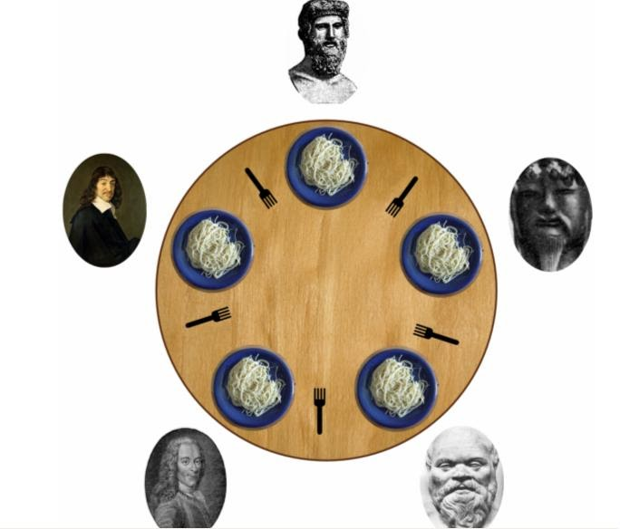

# Philosophers

Philosophers is my project about multithreading in C.

philo_one
> Philosophers are threads, forks are mutex

philo_two
> Philosophers are threads, forks are semaphore

philo_three
> Philosophers are processes, forks are semaphore
